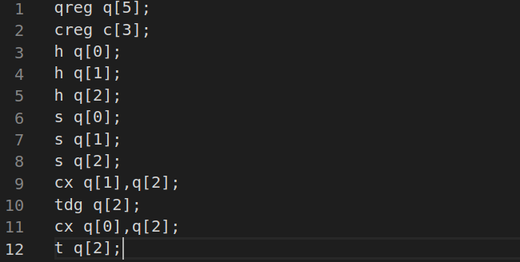

# Experiment_report
## The translation rule:
We suggest that at the begining all of the qubits are |0> state, and because the qubit in |0> state is much more stable than qubit in **Superposition**, we can postpone the operation that change the qubits into **Superposition**.<br>
When there is an operation __A__ like:<br>

	Op q1,q2,...,qn

Op is a kind of quantum operation such as **Hadamard** operation or **CNOT** operation, and q1,q2...qn are qubits. If this instruction is where some of qubits in q1,q2...qn first appear in the code,such as qi, we can postpone this instruction and change qi into **Superposition** later. We put those first appeared qubits q1,q2,...,qn in a Set called **Q**.We define __B__ is a quantum instruction executed later than __A__ (maybe several instructions later) and it is the first time one of qubits in **Q** appear again after __A__, then we can move __A__ just before __B__. Then we can also put those first appeared qubits in __B__ into **Q** and regard __A__ and __B__ as a single unit and do this translation again until there is no available translation.

## Example
Let's think about the OpenQASM program below <br>
The code is part of a 3 qubit grover amplification writed by IBM,you can find it [here](https://github.com/Qiskit/openqasm/blob/master/examples/ibmqx2/011_3_qubit_grover_50_.qasm)

We can see the progra, apply **Hadamard** operation on qubit 0 in line 3——"h q[0]". We suggest line 3 as the instruction __A__ and put q[0] into Set **Q**. Then we will find that q[0] appears again in line 6 "s q[0]". We regard this instruction as __B__. Then we can move line 3 just before line 6. Then we can regard these two instructions "h q[0]" and "s q[0]" as a __A__ and do this translation again. Then we will find q[0] next appear in
line 11——"cx q[0],q[2]". Then we can move both two instruction just before line 11. Then the code will become
```c
qreg q[5];
creg c[3];
h q[1];
h q[2];
s q[1];
s q[2];
cx q[1],q[2];
tdg q[2];
h q[0];
s q[0];
cx q[0],q[2];
t q[2];
```
Then we can regard the last three lines 
```c
h q[0];
s q[0];
cx q[0],q[2];
```
as a single unit. But there is no available translation now,because there is "t q[2]" at the 12 line just after the unit and q[2] appear in it.

## Experiment
We run our testing OpenQASM code one real quantum backend, the [IBM Q 5 Tenerife [ibmqx4]](https://github.com/Qiskit/ibmq-device-information/tree/master/backends/tenerife/V1) provided by IBMQ<br>
To eliminate the time factors, we test the original code and translated code alternately. We test ten groups for each code. Each group contains 1000 times running.<br>
Let's think about this quantum program in OpenQASM
```c
include "qelib1.inc";

qreg a[2];              //1
qreg b;                 //2
creg c[3];              //3

h a;                    //4
measure a[0]->c[0];     //5
cx a[1],b;              //6
measure a[1]->c[1];     //7
measure b->c[2];        //8
```
We concentrate on qubits a[1] and b, and their measure result in register c[1,2]. We apply a **Hadamard** operation on a[1] and change it into a **Bell State**. Then we use a[1] as control qubit to apply a **CNOT** operation on qubits a[1] and b[0]. Now the state of a[1] and b[0] should be identical, both |1> or both |0>. So the theoretical result of c[1,2] is 50% percent of [00] and 50% of [11]. <br>

We know that a qubit operation is not always correct, so in the experiment we will find sometimes the result of c[1,2] is [01] or [10]. We suggest the percent of state [01] or [10] is this circuit's error rate. We run this circuit for 10000 times and we get the result.<br>

  | Measure result | Percent(%) |
  | :------------: | :--------: |
  | 00             | 46.37%     |
  | 01             | 6.30%      |
  | 10             | 7.77%      |
  | 11             | 39.83%     |

We can get the error rate is  6.30%+7.77%=14.07%<br>
If we check the code carefully, we will find that the qubit a[1] go through **Hadamard** operation and become **Superposition**in line 4, and it remain superposed for a long time.(The measure operation cost lots of time) This will increase the error rate because **Superposition** is much more unstable than |0> state.
if we adjust the code and postpone the **Hadamard** operation of a[1] after first measurent, the error rate will decrease.
```c
include "qelib1.inc";

qreg a[2];              //1
qreg b;                 //2
creg c[3];              //3

h a[0];                 //4
measure a[0]->c[0];     //5
h a[1];                 //6
cx a[1],b;              //7
measure a[1]->c[1];     //8
measure b->c[2];        //9
```
We also test for 10000 times, and the measure result is

  | Measure result | Percent(%) |
  | :------------: | :--------: |
  | 00             | 46.93%     |
  | 01             | 6.13%      |
  | 10             | 6.41%      |
  | 11             | 40.53%     |

The error rate is 6.13%+6.41%=12.54%, we cut off 11% of the error rate.<br>
